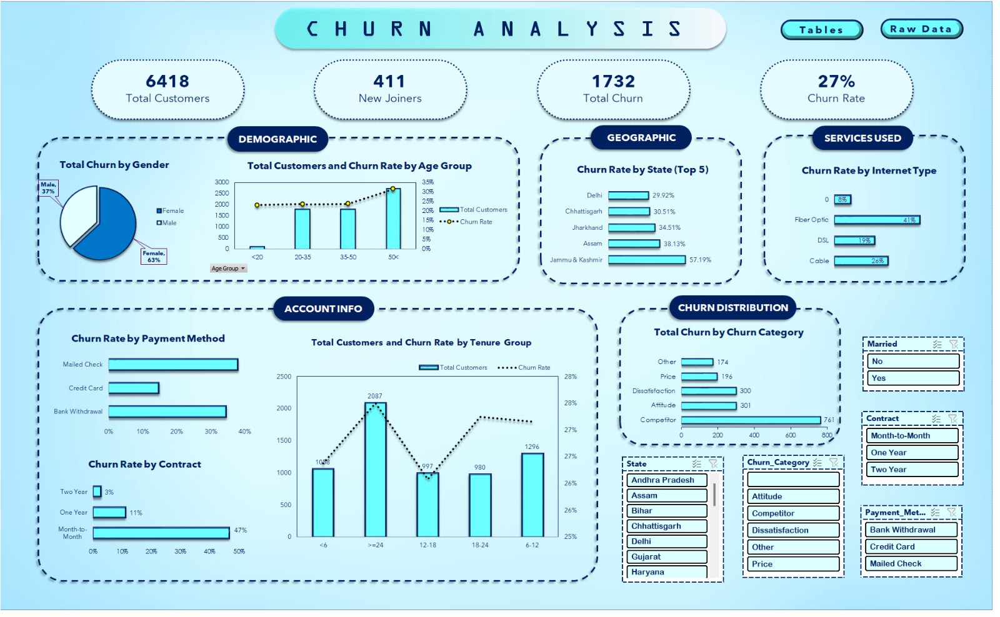

# Customer Churn Analysis Dashboard

## Project Overview
Customer churn is a critical problem for subscription-based businesses such as telecommunications companies.  
This project presents an **interactive Excel dashboard** designed to analyze customer churn and identify patterns that contribute to customer attrition.

Using raw customer data, the project performs **data cleaning, transformation, and analysis in Excel**, followed by building an interactive dashboard that helps stakeholders understand churn trends and identify high-risk customer segments.

The dashboard enables data-driven decision making by highlighting **key churn drivers such as contract type, internet service, payment methods, and geographic regions.**

---

## Dashboard Preview

---

## Key Metrics
The dashboard highlights important business metrics including:

- Total Customers: **6418**
- New Joiners: **411**
- Total Churned Customers: **1732**
- Overall Churn Rate: **27%**

---

## Key Features

### Data Cleaning & Transformation
- Cleaned raw customer data using Excel functions
- Standardized categorical variables
- Prepared structured tables for analysis

### Exploratory Data Analysis
Analysis of churn across multiple dimensions:

- Gender
- Age Group
- State
- Internet Type
- Payment Method
- Contract Type
- Customer Tenure

### Interactive Dashboard
- Dynamic charts and slicers
- Drill-down analysis across customer attributes
- Visual identification of high-risk customer segments

### Visualizations Included
- Churn Rate by Age Group
- Churn by Gender
- Churn Rate by State
- Churn Rate by Internet Type
- Churn Rate by Payment Method
- Churn Rate by Contract Type
- Churn Distribution by Churn Category
- Customer Distribution by Tenure

---

## Dataset Description

The dataset contains anonymized telecom customer data with over **6,000 records** including:

- Customer demographics (Age, Gender, State)
- Service information (Internet Type, Contract Type)
- Payment details (Payment Method)
- Customer tenure
- Churn status
- Churn category and reason

The dataset was processed and summarized using **Excel pivot tables and calculated metrics**.

---

## Key Insights

Some important insights discovered from the analysis:

- **Fiber optic users show the highest churn rate (~41%)**
- **Month-to-month contracts have the highest churn (~47%)**
- **Customers with shorter tenure are more likely to churn**
- **Jammu & Kashmir shows the highest churn rate (~57%)**
- **Competitor offers are the most common churn reason**

These insights help businesses develop **targeted retention strategies** such as improving service quality, offering long-term contracts, and providing competitive pricing.

---

## Tools & Technologies Used

- Microsoft Excel
  - Pivot Tables
  - Data Cleaning
  - Dashboard Design
  - Charts & Visualization
  - Slicers & Interactive Filters

---

## How to Use

1. Download the Excel file from the repository
2. Open **Customer Churn Analysis Dashboard.xlsx**
3. Navigate through sheets:
   - **Dashboard** → Interactive dashboard view
   - **Tables** → Pivot tables and summary calculations
   - **Raw Data** → Original dataset
4. Use slicers and filters to explore churn patterns.

---

## Project Objective

The goal of this project is to demonstrate skills in:

- Data Cleaning
- Data Analysis
- Business Insight Generation
- Dashboard Design
- Excel-based Data Visualization

---

## Author

**Krish Agrawal**  
B.Tech, NIT Raipur
Aspiring Data Analyst

Skills:  
SQL | Excel | Data Analysis | Dashboard Development